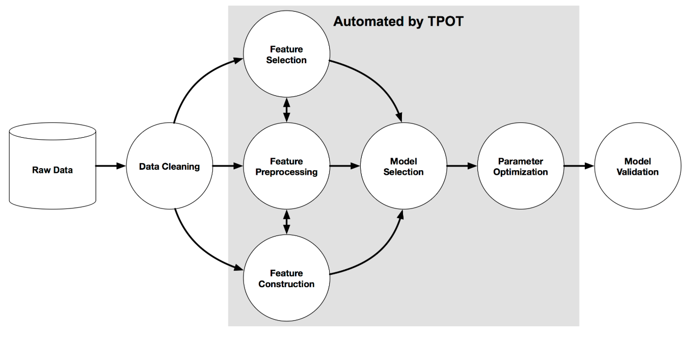

## Automated Machine Learning with TPOT

For part two of my automated machine learning series I am focusing on [TPOT](https://epistasislab.github.io/tpot/), a python library that uses genetic programming to optimize data science pipelines. TPOT's success and popularity has grown extraordinarily since its initial commit in late 2015. As of March 20, 2019, TPOT has 286 people watching, 5,441 stars, and 969 forks on [GitHub](https://github.com/EpistasisLab/tpot). 

TPOT stands for Tree-Based Pipeline Optimization Tool, and has the goal to help automate the development of ML pipelines by combining flexible tree representation of pipelines with stochastic search algorithms to develop the best scikit-learn library possible. Once the best predictive pipeline has been found, TPOT will export the pipeline as Python code so that a data scientist can continue developing from there. In addition to faster development and great models, my experience with TPOT is that it great learning tool for newer data scientists who may want to understand how to develop better models manually. 

One advantage of Auto Machine Learning is the ability to automatically retrain different types of models with different parameters and columns as your data changes. This enables a data scientist to provide a solution that is dynamic and intelligent, however, automated machine learning is compute intensive and time consuming because it is training several different models. TPOT gives users the ability to export their model to a python script to avoid having to apply automated machine learning to every retraining process allowing for fast retraining of a model with the same high-performing accuracy.    

Like most automated machine learning libraries TPOT helps automated everything but data acquisition, data cleaning, and complex feature engineering for machine learning. TPOT, like scikit-learn, does provide some simple and dynamic feature engineering functions.    

  

In the first part of my automated machine learning series I evaluated the Azure Machine Learning Auto ML library. Unlike the end to end platform that Azure Machine Learning provides, TPOT is a standalone package meant for developing the best models. In my experience TPOT is an excellent package that can be used in union with platforms like Azure ML and MLFlow to not only train the best model, but manage the data science lifecycle.  

The best way to familiarize yourself with TPOT is to get started! Check out the demo I have created and the accompanying code on my [GitHub](https://github.com/ryanchynoweth44/AutoMLExamples/blob/master/TPOT/walkthrough/01_EnvironmentSetup.md). Please note that staying in line with our Azure Machine Learning Auto ML example we will be using the Titanic Dataset, which is also an [example solution](https://epistasislab.github.io/tpot/examples/#titanic-survival-analysis) provided by the TPOT developers. The walk through I provide is slightly different than the one they provide, particularly surrounding the one-hot encoding of a variable that I deemed unnecessary.     

